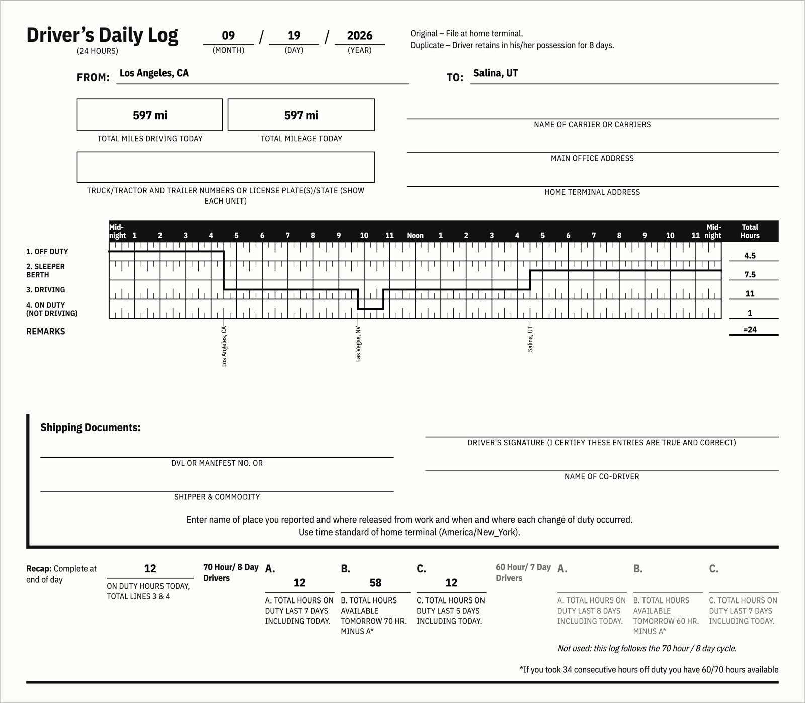

# spotter-eld

**Live app: https://spotter-eld-eight.vercel.app** · API: https://spotter-eld-api-p2rq.onrender.com · Source: https://github.com/abhaybansal0322/spotter-eld

The API runs on Render's free tier, which sleeps after 15 idle minutes. If it has slept, the first request takes up to 45 seconds while it wakes; the loading screen says so. After that, plans return in 1 to 8 seconds.



## What it does

Given where a property-carrying truck is now, a pickup, a dropoff and the hours already used in the driver's 70-hour/8-day cycle, spotter-eld routes the trip for a truck and schedules it under the FMCSA hours-of-service rules: driving, the 30-minute break, 10-hour rests, fuel stops and, when the cycle runs out, a 34-hour restart. It shows the route and every stop on a map and a timeline, and draws one filled-in Driver's Daily Log per calendar day, the same paper form a driver would complete by hand. Every plan gets a shareable link.

## Assumptions

The assignment fixes the ruleset (property-carrying, 70 hours/8 days, no adverse conditions), a fuel stop at least every 1,000 miles, and one hour each for pickup and dropoff. Everything else below is a choice, stated so it can be checked.

| Assumption | Value | Basis |
|---|---|---|
| Average speed | 55 mph | A standard planning figure for loaded trucks; no speed was given. Driving time is derived from road miles at this speed |
| Pickup and dropoff | 1 hour each, on duty not driving | Given. Logged on line 4 as on-duty time (§395.2) |
| Fuel stop | 30 minutes, on duty not driving, at least every 1,000 miles | Frequency given, duration chosen. Fueling is on-duty time under the §395.2 definition ("servicing... including fueling"), so it burns the 14-hour window and the cycle, not driving time |
| Starting condition | Fresh off 10 consecutive hours off duty | Only a cycle-hours total is supplied, no duty history, so the 11-hour and 14-hour clocks start at zero (§395.3(a)(1)) |
| Rest status | 10-hour rests logged as sleeper berth, 30-minute breaks as off duty | Both are legal for either purpose (§395.3(a)(1), §395.3(a)(3)(ii)); one fixed convention keeps logs consistent |
| Prior cycle hours | One lump that never rolls off within the 8-day window | The input is a single total, not a per-day history. It can only overstate the cycle, never understate it (§395.3(b)(2)) |
| Time zone | One home terminal zone for every time on every sheet, default America/New_York | §395.8 requires the home terminal's time standard even when the route crosses zones. The start time and zone sit behind an Advanced toggle |
| Start time | Now, rounded down to 15 minutes, unless set | Every derived boundary lands on the log's 15-minute grid, so nothing is rounded afterwards |

## Hours-of-service rules

Implemented, each as a small rule class whose driving allowance the engine takes the minimum of:

- **11-hour driving limit**, §395.3(a)(3): at most 11 hours of driving after 10 consecutive hours off duty.
- **14-hour window**, §395.3(a)(2): no driving after the 14th hour since work began. Breaks do not pause it. It forbids driving only, so on-duty work at a dropoff can still finish after hour 14.
- **30-minute break**, §395.3(a)(3)(ii): required after 8 cumulative hours of driving. Any 30 consecutive non-driving minutes count, so a one-hour pickup or a fuel stop clears it and no redundant break is inserted.
- **70 hours in 8 days**, §395.3(b)(2): a rolling window over driving plus on-duty time. At 70, driving stops.
- **34-hour restart**, §395.3(c): inserted when the cycle blocks the trip, resetting it to zero.
- **Record of duty status**, §395.8: date, miles, per-status totals that sum to 24, remarks with a city and state at every duty change, and the recap boxes.

Out of scope, present only as named placeholders that raise `NotImplementedError`:

- **Adverse driving conditions**, §395.1(b)(1): the assignment assumes none.
- **Split sleeper berth**, §395.1(g): a pairing of rest periods the planner never needs, since it always takes a full 10-hour rest.
- **Short-haul exception**, §395.1(e): for drivers who return to their work reporting location within 14 hours; not this use case.
- **60 hours in 7 days**, §395.3(b)(1): the assignment specifies the 70/8 cycle. The sheet keeps the form's 60/7 recap column and marks it unused.

## Accepted simplifications

Each is legal and each errs conservative.

- **The two mileage boxes match.** "Total mileage today" is the vehicle's miles and "total miles driving today" the driver's. They differ only with a co-driver or another driver in the same truck, and every plan here is solo. Both come from route positions, so a trip's sheets add up to its route distance.
- **Daylight-saving changeovers are off by an hour.** Every day is treated as 1,440 minutes on the wall clock.
- **A blocked cycle always gets a full 34-hour restart**, rather than waiting for the oldest day to roll off, which would need simulating idle days for a marginal gain.
- **A 30-minute break can land shortly before a forced 10-hour rest** and do little useful work, which is how real paper logs look.
- **The rolling 8-day drop-off never fires on a generated trip.** The engine plans at the limits, so the cycle reaches 70 and takes a restart before eight days pass. The drop-off is implemented and tested for a driver who arrives with a partial cycle.

## OpenRouteService quota

Routing and geocoding use OpenRouteService's free tier. Its limits, measured from response headers on a free key, are far below the published figures: **200 directions, 100 geocode searches and roughly 100 reverse geocodes per day**. When a quota runs out, ORS answers HTTP 403 with `{"error": "Quota exceeded"}` and no rate-limit headers.

A long plan spends 3 searches, 1 route and about 11 reverse lookups, one per inserted stop, so an uncached key would stop naming stops after about nine long trips. Stop names are best effort: a failed reverse lookup degrades a label to a road and a nearby resolved town (`"I 80 near Ottawa, IL"`, or with the distance when that town is more than 50 miles away) instead of failing the plan. **A label like that means the quota ran out, not that the planner is wrong.**

To keep the demo inside the quota, geocode results persist in Postgres (`GeocodeCache`) behind the in-process cache. Answers never expire, genuine no-matches are cached, and quota or server failures are not. `python manage.py prewarm FROM PICKUP TO --cycle-hours 0,20,50` plans a route once per cycle-hours value to fill the cache and reports hits against ORS calls; a warmed long plan costs 1 ORS call, the route. Rest and fuel stops land at the same miles whatever the start time, so they stay cached, but the remark written at each midnight falls somewhere else when the start time changes, so a plan at a new start time typically costs one or two extra reverse lookups.

## Implementation notes

- **Reverse geocoding uses `layers=address`.** With admin-only layers, Pelias runs a point-in-polygon lookup that silently ignores the search radius and answers with the county wherever a stop is outside town limits. Nearby addresses carry their town, and the radius (15 km, then 150 km) is honoured.
- **Routes avoid border crossings.** The unconstrained truck route from Los Angeles to Boston cuts through Ontario, and a Part 395 log should not.
- **Addresses ending in a state code must match that state.** Pelias almost never reports no match: "Atlantis, ZZ" resolves to Atlantis, FL with full confidence. Without the check an unknown address would be routed to the wrong city instead of rejected.
- **Trips over the routing limit return a readable 422.** ORS rejects routes whose approximate length exceeds 6,000 km; the API says the trip is too long rather than that no route exists.
- **Naming lookups round to the nearest 5 miles.** A town does not change within 5 miles, and the shared point lets cached answers serve nearby stops. Stops keep their exact miles.
- **Saving a plan is best effort.** If the database write fails the plan is still returned, marked `stored: false`, and the share link is hidden.

## Architecture

```
views  ->  serializers  ->  services/planner
                                  |
                    +-------------+-------------+
                    |                           |
            geocode / routing            services/hos/*
            (network, mockable)          (pure, stdlib only)
                    |
              route_index (pure)
```

The hours-of-service core, `backend/trips/services/hos/`, is pure: integer minutes since trip start, no Django, no HTTP client, no `datetime`. Two tests walk the AST to enforce the boundaries: nothing in `hos/` imports Django, `requests` or `datetime`, and only `http.py`, `geocode.py` and `routing.py` import an HTTP client. Every limit lives once in `hos/constants.py` and reaches the frontend through the API's `limits` object, so no regulatory number is hardcoded in TypeScript. The planner is the only module that knows about both geography and hours of service.

On the frontend, all log-grid arithmetic (minutes to x, status to y, the continuous duty line, the three tick heights, remark placement) lives in `frontend/src/lib/logGrid.ts` as pure functions; `LogGrid.tsx` only places what it is given.

The full design record, including the API contract and the reasoning behind each decision, is in [docs/DESIGN.md](docs/DESIGN.md).

## Testing

278 backend tests (pytest) and 135 frontend tests (vitest). Both suites run offline: ORS is faked at a single seam, `services/http.py`, with canned payloads, and the frontend mocks its API client. The worked example on page 18 of the FMCSA *Interstate Truck Driver's Guide to Hours of Service* (John Doe, Richmond VA to Newark NJ) is encoded as a fixture and must reproduce the guide's totals: 10 hours off duty, 1.75 sleeper berth, 7.75 driving and 4.5 on duty, summing to 24. Every generated sheet in every test is asserted to cover exactly 24 hours.

## Local setup

Python 3.12 and Node 20.19 or later.

Backend, from `backend/`:

```bash
python3.12 -m venv venv && source venv/bin/activate
pip install -r requirements-dev.txt
cp .env.example .env   # set ORS_API_KEY; the rest has working local defaults
python manage.py migrate
python manage.py runserver
```

Without `DATABASE_URL` it uses SQLite. `manage.py` defaults to the dev settings.

Frontend, from `frontend/`:

```bash
npm install
cp .env.example .env   # VITE_API_URL=http://localhost:8000
npm run dev
```

Tests:

```bash
cd backend && pytest
cd frontend && npm test && npm run typecheck
```

Environment variables, all listed in the two `.env.example` files: `ORS_API_KEY`, `SECRET_KEY`, `DATABASE_URL`, `DJANGO_ENV`, `ALLOWED_HOSTS`, `CORS_ALLOWED_ORIGINS` and `NUM_PROXIES` for the backend, `VITE_API_URL` for the frontend.

## Deploying

- **Backend on Render** from `render.yaml`: a free web service and a free Postgres database. Free services cannot run a pre-deploy command, so `migrate` and `createcachetable` run in the build command. `NUM_PROXIES=2` tells the throttle how many proxies Render puts in front of Django, so it limits each client rather than Render's internal addresses. Gunicorn runs two workers with a 60-second timeout.
- **Frontend on Vercel** with `frontend` as the root directory and `VITE_API_URL` set to the Render URL. `frontend/vercel.json` rewrites `/trip/*` to `index.html`; without it every shared link would 404.
- **The free Postgres database expires 30 days after creation, around 17 October 2026**, and is deleted 14 days later, taking stored trips, share links and the geocode cache with it.
